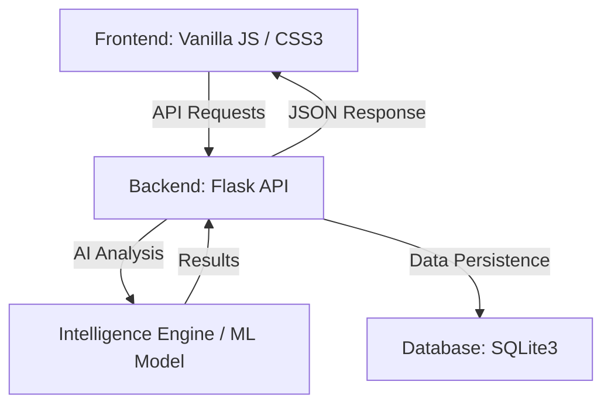
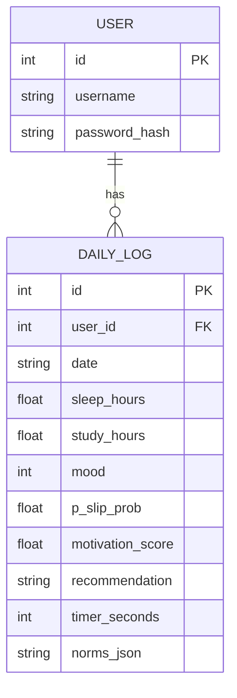
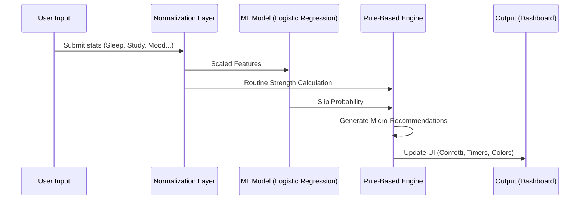

# PROJECT REPORT: Smart Habit AI 🧠✨

**Submitted to:** KIIT Deemed to be University  
**Degree:** Bachelor’s Degree in Information Technology  
**Date:** March 2026

---

## LIST OF FIGURES
- **Figure 1.1:** System Architecture (3-Tier)
- **Figure 3.1:** Database Entity-Relationship Diagram
- **Figure 4.1:** AI Intelligence Engine Process Flow
- **Figure 4.2:** Dashboard Interface (Result Analysis)
- **Figure 4.3:** Habit Breakdown Visualization (Result Analysis)

---

## ABSTRACT
Smart Habit AI is an intelligent full-stack application designed to transition habit tracking from a passive data-logging activity to a proactive behavioral optimization process. By leveraging a Logistic Regression machine learning model and a custom-weighted intelligence engine, the system predicts the probability of a user "slipping" in their routine. It provides real-time, actionable micro-recommendations with integrated timers to stabilize daily habits. The application features a premium glassmorphism UI, secure JWT authentication, and an automated "Gentle Mode" for recovery on challenging days.

---

## CHAPTER 1: INTRODUCTION
In an era of increasing digital distractions and stress, maintaining a consistent routine is vital for mental and physical well-being. Smart Habit AI introduces "active" tracking. It analyzes underlying variables—sleep, mood, and workload—to predict a routine failure before it happens.

---

## CHAPTER 2: BASIC CONCEPTS / LITERATURE REVIEW
### 2.1 Machine Learning (Logistic Regression)
Binary classification used for slip prediction based on normalized behavioral inputs.

### 2.2 Glassmorphism UI
A design language utilizing semi-transparent elements and background blur to create depth and focus.

---

## CHAPTER 3: PROBLEM STATEMENT / REQUIREMENT SPECIFICATIONS
### 3.1 System Architecture
The application follows a standard 3-tier architecture to ensure scalability and separation of concerns.

**Figure 1.1: System Architecture**

### 3.2 Database Design
The data layer is managed via SQLite, with specific focus on relational integrity between users and their daily logs.

**Figure 3.1: Database ER Diagram**

---

## CHAPTER 4: IMPLEMENTATION
### 4.1 AI Intelligence Engine
The core logic combines a deterministic weighting system with a predictive ML layer.

**Figure 4.1: AI Intelligence Engine Process Flow**

### 4.2 Result Analysis
The following figures demonstrate the successful implementation of the AI-driven dashboard and breakdown visualizations.

**Figure 4.2: Dashboard Interface**  
*(Refer to: interfaces/Screenshot 2026-02-16 201036.png)*

**Figure 4.3: Habit Breakdown Visualization**  
*(Refer to: mistakes/Screenshot 2026-03-02 231928.png)*

---

## CHAPTER 5: STANDARDS ADOPTED
- **Coding Standards:** PEP 8 (Python), ES6+ (JavaScript).
- **Security:** JWT Authentication, PBKDF2 Password Hashing.

---

## CHAPTER 6: CONCLUSION AND FUTURE SCOPE
### 6.1 Conclusion
The integration of ML slip prediction with a rule-based recommendation engine proved successful in providing proactive routine support.

---

## REFERENCES
1. Scikit-learn Documentation.
2. Flask Framework Documentation.
3. Pipeline.pdf Design Documentation.
